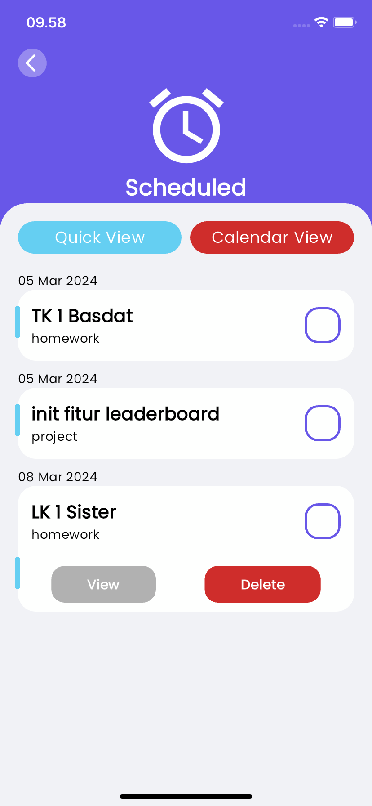

# Todos

Todos adalah aplikasi Todo List yang memiliki fungsi utama untuk menyimpan ToDo sebagai second brain. Todos ini memiliki basis category untuk menyimpan ToDo. Pengguna dapat membuat category terlebih dahulu kemudian dapat menyimpan ToDo pada category tersebut. Mari kita pelajari lebih dalam mengenai aplikasi ini.

## Features
### Home Page

 

- Pada halaman ini, pengguna dapat melihat search bar untuk search category yang telah dibuat, data dashboard yang jika di tap akan meng-direct ke halaman dashboard terkait, category-category yang telah dibuat, floating action button berlogo "+" untuk menambahkan category, dan floating navbar.

- Download aplikasi ini untuk membuat category.
 

### Category Page

 

- Pada halaman ini, pengguna dapat melihat ToDo hari ini dalam suatu category dan dapat melihat total ToDo dengan tap container Total ToDo.

- Setelah tap container Total ToDo, pengguna dapat melihat semua ToDo dalam category.

- Setiap ToDo dapat dioperasikan CRUD

- Download aplikasi ini untuk menceklis ToDo yang anda buat.

### Dashboard Page

- Pada today page, pengguna dapat melihat ToDo apa saja yang pengguna set started hari ini

- Pada scheduled page, pengguna dapat melihat semua ToDo dengan informasi tanggal. Pengguna dapat memilih Quick view atau Calendar View.

- Pada completed page, pengguna dapat melihat semua ToDo yang pengguna telah ceklis.

- Semua ToDo pada masing-masing dashboard page dapat dioperasikan CRUD.

### Profile Page

- Profile page merupakan isi informasi pribadi developer. Terdapat floating action button untuk melihat informasi lainnya.

## Library

Library yang digunakan sebagai fondasi aplikasi ini adalah

State Management

- Untuk pengelolaan app state, aplikasi ini menggunakan BLoC Cubit state management. Pada aplikasi ini, Cubit digunakan sebagai business logic aplikasi ini. CRUD ToDo, Data (Category dan ToDo) Management, Filter dan Sorting,serta rebuild UI. Menurut interpretasi developer, Cubit Provider yang digunakan aplikasi ini merupakan Backend aplikasi ini.

Local Storage

- Untuk memastikan persistensi data, aplikasi ini menggunakan Shared Preferences. Shared Preferences menyediakan utilitas untuk menyimpan dan memuat data secara lokal pada perangkat. Esensinya dalam konteks tugas ini adalah Category dan ToDo yang disimpan persisten dalam aplikasi sehingga data tersebut tidak hilang saat aplikasi ditutup atau perangkat di-restart.

Date and Time Formatter

- Untuk memformat tanggal dan waktu sesuai dengan lokasi pengguna, aplikasi ini menggunakan intl. Penggunaan intl dalam aplikasi tidak hanya sebatas untuk menformat tanggal dan waktu, tetapi juga untuk membantu logika sorting berdasarkan tanggal dan logika calendar view pada Scheduled Dashboard.

## Lesson Learned
Proses pengembangan dimulai dengan mencari referensi dari reminder iPhone untuk dijadikan inspirasi. Saya menilai UI reminder iPhone terlalu sederhana dan minim warna, sehingga saya mencari ide desain UI tambahan di [Behance]('https://www.behance.net'). Akhirnya, saya mengembangkan aplikasi dengan fungsi serupa aplikasi reminder iPhone, namun dengan UI yang saya desain berdasarkan kombinasi berbagai referensi dari Behance.

Saat menginisialisasi project, saya mula-mula menentukan dahulu library dependency apa saja yang akan saya pakai. Saya memilih BLoC Cubit untuk state management, Shared Preferences untuk local storage, dan intl sebagai date formatter. 

Saya mengawali development dengan layouting widget dan membuat logika CRUD ToDo nya per page. Saya menyimpan ToDo di dalam Category seperti reminder iPhone. Jadi, saya merancang model nya terlebih dahulu. Dalam membuat fungsionalitasnya, saya sudah cukup terbiasa dengan BLoC Cubit dan Shared Prefereces. Selama liburan semester ganjil, saya mempelajarinya dengan membuat project pribadi. Dalam pengembangan fungsionalitas menggunakan Cubit di Flutter, saya menghadapi tantangan, khususnya dalam memperbarui UI. Meskipun Cubit memudahkan dalam mentrigger perubahan state, saya sering kali kesulitan mengambil data ToDo saat pengguna pertama kali membuka sebuah halaman. Saya mengeksplorasi penggunaan [`WidgetsBinding`]('https://youtu.be/ugvVgVSm3Wo?si=BoXnBZy8pS50oPvk')
setelah menonton beberapa tutorial di YouTube, mencari alternatif selain `initState` untuk membuat halaman tanpa state (`StatelessWidget`). Namun, saya menghadapi masalah di mana UI tidak terupdate meskipun state tampaknya sudah diatur dengan benar. Sebagai solusi, saya menggabungkan penggunaan Cubit dengan `setState()` untuk mengatasi masalah tersebut. 

Saya belajar banyak metode list di Dart karena tertantang membuat one-liner for loop, beralih dari penggunaan .map() dan for each biasa ke penggunaan method-method tersebut. Saya terkesan dengan berbagai method Dart yang memudahkan manipulasi list.

Seperti yang saya jelaskan sebelumnya, saya sudah familiar dengan Shared Preferences. Jadi tidak ada kendala yang begitu rumit untuk pengerjaan bonus. Dan terakhir, saya berusaha untuk membuat aplikasi ini responsive terhadap banyak gadget. Saya mempelajari beberapa pendekatan implementasi [responsive UI]('https://youtu.be/Tdpvv5t67l4?si=x9bwL-Rkz7Sp2ekI') di youtube. 

